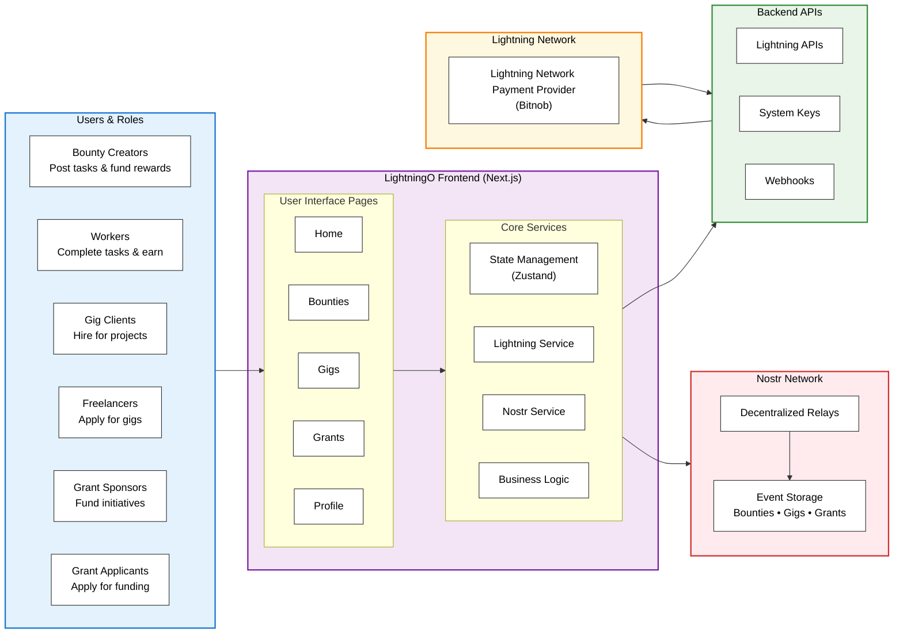

# LightningO

**LightningO** (Lightning Opportunities) is a decentralized platform for earning opportunities powered by Bitcoin Lightning payments and Nostr protocol. Create and participate in bounties, gigs, and grants with instant Lightning payments.

[](https://opensource.org/licenses/MIT)
[](https://nextjs.org/)
[](https://www.typescriptlang.org/)
[](https://tailwindcss.com/)

## Features

### **Bounties**

- Create one-time tasks with fixed rewards
- Submit work with rich text descriptions
- Instant Lightning payments upon approval
- Decentralized through Nostr protocol

### **Gigs**

- Multi-milestone projects with structured payments
- Sequential milestone funding and approval
- Rich text descriptions and portfolio links
- Progress tracking and milestone management

### **Grants**

- Tranche-based funding for larger projects
- Multiple applicants can be selected
- Sequential tranche funding and approval
- Flexible reward structures (fixed or range)

### **Lightning Integration**

- Real-time Lightning payments via Bitnob
- QR code generation for invoice payments
- Development mode with simulated payments
- Webhook integration for payment confirmations

### **Nostr Protocol**

- Decentralized event publishing and subscription
- No central servers required
- Censorship-resistant platform
- Real-time updates across relays

## NIPs (Nostr Implementation Possibilities)

LightningO implements several standard NIPs and defines custom NIPs for its specific functionality:

### Standard NIPs

#### **NIP-01: Basic protocol flow**

- Core Nostr protocol implementation for event creation, signing, and verification
- Event structure with `id`, `pubkey`, `created_at`, `kind`, `content`, `sig`, and `tags`
- Event validation and signature verification

#### **NIP-05: Mapping Nostr keys to DNS-based internet identifiers**

- Support for `nip05` field in user profiles
- Enables human-readable identifiers (e.g., `user@domain.com`)

#### **NIP-16: Event Treatment**

- Custom event kinds for bounty, gig, and grant operations
- Proper event handling and processing

### Custom NIPs

LightningO defines custom event kinds for its decentralized opportunity platform. For complete implementation details, see [`src/types/nostr.ts`](src/types/nostr.ts):

#### **Bounty Events (Kind Range: 51341-51344)**

| Kind  | Name              | Description                                          |
| ----- | ----------------- | ---------------------------------------------------- |
| 51341 | `bounty:create`   | Create a new bounty with details and reward          |
| 51342 | `bounty:open`     | Mark bounty as open for submissions with escrow info |
| 51343 | `bounty:complete` | Mark bounty as completed with winner details         |
| 51344 | `bounty:submit`   | Submit work for a bounty                             |

#### **Gig Events (Kind Range: 51401-51409)**

| Kind  | Name                    | Description                                 |
| ----- | ----------------------- | ------------------------------------------- |
| 51401 | `gig:create`            | Create a new gig with milestones            |
| 51402 | `gig:apply`             | Apply to a gig with proposal and milestones |
| 51403 | `gig:select`            | Select an applicant for a gig               |
| 51404 | `gig:funded`            | Fund a milestone with Lightning payment     |
| 51405 | `gig:submit_milestone`  | Submit work for a milestone                 |
| 51406 | `gig:approve_milestone` | Approve milestone submission                |
| 51407 | `gig:reject_milestone`  | Reject milestone submission                 |
| 51408 | `gig:complete`          | Mark gig as completed                       |
| 51409 | `gig:cancel`            | Cancel a gig                                |

#### **Grant Events (Kind Range: 51501-51508)**

| Kind  | Name                    | Description                           |
| ----- | ----------------------- | ------------------------------------- |
| 51501 | `grant:create`          | Create a new grant with tranches      |
| 51502 | `grant:apply`           | Apply to a grant with proposal        |
| 51503 | `grant:select`          | Select applicants for a grant         |
| 51504 | `grant:funded`          | Fund a tranche with Lightning payment |
| 51505 | `grant:submit_tranche`  | Submit work for a tranche             |
| 51506 | `grant:approve_tranche` | Approve tranche submission            |
| 51507 | `grant:reject_tranche`  | Reject tranche submission             |
| 51508 | `grant:cancel`          | Cancel a grant                        |

### Event Content Structure

All custom events follow a consistent content structure:

```typescript
interface EventContent {
  type: string; // Event type identifier
  [entityId]: string; // ID of the bounty/gig/grant
  // ... additional fields based on event type
}
```

### Event Tags

Events may include standard and custom tags:

- `system-pubkey`: Identifies system-generated events
- Standard Nostr tags for replies, mentions, etc.

### Relay Support

LightningO is compatible with any standard Nostr relay and uses these default relays:

- `wss://relay.damus.io`
- `wss://relay.primal.net`
- `wss://nos.lol`
- `wss://relay.snort.social`

## Quick Start

### Prerequisites

- Node.js 18+
- pnpm
- Bitcoin Lightning wallet (for production)
- Bitnob API account (for Lightning payments)

### Installation

1. **Clone the repository**

   ```bash
   git clone https://github.com/Leeyah-123/lightning-o.git
   cd lightning-o
   ```

2. **Install dependencies**

   ```bash
   pnpm install
   ```

3. **Set up environment variables**

   ```bash
   cp env.example .env.local
   ```

   Edit `.env.local` with your configuration:

   ```env
   # Required
   BITNOB_API_KEY=your_bitnob_api_key_here
   SYSTEM_PRIVATE_KEY=your_system_private_key_here // This Nostr private key will be used to publish system events on Nostr after invoice are paid

   # Optional
   NEXT_PUBLIC_APP_URL=http://localhost:3000
   BITNOB_WEBHOOK_SECRET=your_webhook_secret_here
   ```

4. **Generate system keys** (if you don't have them)

   ```bash
   # Install nostr-tools globally
   npm install -g nostr-tools

   # Generate a new keypair
   nostr-tools generate
   ```

5. **Start the development server**

   ```bash
   pnpm dev
   ```

6. **Open your browser**
   Navigate to [http://localhost:3000](http://localhost:3000)

## Architecture

### System Overview



### Frontend

- **Next.js 15** with App Router
- **TypeScript** for type safety
- **Tailwind CSS** for styling
- **ShadCN UI** components
- **Zustand** for state management
- **React Hook Form** with Zod validation
- **Tiptap** rich text editor

### Backend

- **Next.js API Routes** for serverless functions
- **Bitnob API** for Lightning payments
- **Nostr Protocol** for decentralized communication
- **Webhook integration** for payment confirmations

### Key Services

- **Lightning Service**: Handles payment creation and processing
- **Nostr Service**: Manages event publishing and subscription
- **Profile Service**: User authentication and key management
- **Bounty/Gig/Grant Services**: Business logic for each opportunity type

## Project Structure

```
src/
├── app/                    # Next.js App Router
│   ├── api/               # API routes
│   │   ├── lightning/     # Lightning payment endpoints
│   │   └── webhooks/      # Webhook handlers
│   ├── bounties/          # Bounty pages
│   ├── gigs/              # Gig pages
│   ├── grants/            # Grant pages
│   └── pay/               # Payment pages
├── components/            # React components
│   ├── auth/              # Authentication components
│   ├── bounty/            # Bounty-specific components
│   ├── gig/               # Gig-specific components
│   ├── grant/             # Grant-specific components
│   ├── layout/            # Layout components
│   └── ui/                # Reusable UI components
├── lib/                   # Utility functions
├── services/              # Business logic services
├── store/                 # Zustand state stores
├── types/                 # TypeScript type definitions
└── validators/            # Zod validation schemas
```

## Configuration

### Environment Variables

| Variable                     | Description        | Required | Default                  |
| ---------------------------- | ------------------ | -------- | ------------------------ |
| `NODE_ENV`                   | Environment mode   | No       | `development`            |
| `NEXT_PUBLIC_APP_URL`        | Application URL    | No       | `http://localhost:3000`  |
| `BITNOB_API_KEY`             | Bitnob API key     | Yes      | -                        |
| `NEXT_PUBLIC_BITNOB_API_URL` | Bitnob API URL     | No       | `https://api.bitnob.com` |
| `BITNOB_WEBHOOK_SECRET`      | Webhook secret     | Yes      | -                        |
| `SYSTEM_PRIVATE_KEY`         | System private key | Yes      | -                        |

### Bitnob Setup

1. Create an account at [bitnob.com](https://bitnob.com)
2. Generate an API key from your dashboard
3. Set up webhook endpoints for payment confirmations
4. Add your webhook secret to environment variables

### Nostr Relays

The application uses default Nostr relays, but you can configure custom ones:

```env
NEXT_PUBLIC_NOSTR_RELAYS=wss://relay.damus.io,wss://nos.lol,wss://relay.snort.social
```

## Usage

### For Sponsors

1. **Connect your Nostr wallet** to create opportunities
2. **Create bounties, gigs, or grants** with detailed descriptions
3. **Review applications** and select the best candidates
4. **Fund milestones/tranches** as work progresses
5. **Approve submissions** to release payments

### For Talent

1. **Browse opportunities** across bounties, gigs, and grants
2. **Apply with your portfolio** and detailed proposals
3. **Submit work** for funded milestones/tranches
4. **Receive Lightning payments** upon approval

## Development

### Available Scripts

```bash
pnpm dev          # Start development server
pnpm build        # Build for production
pnpm start        # Start production server
pnpm lint         # Run ESLint
```

### Development Mode

In development mode, Lightning payments are simulated:

- Click "Pay (Dev)" buttons to simulate payments
- No real Bitcoin transactions occur
- Webhooks are called locally for testing

### Testing

```bash
# Run linting
pnpm lint

# Type checking
npx tsc --noEmit
```

## Deployment

### Vercel (Recommended)

1. **Connect your repository** to Vercel
2. **Set environment variables** in Vercel dashboard
3. **Deploy** automatically on push

### Other Platforms

1. **Build the application**

   ```bash
   pnpm build
   ```

2. **Start the production server**

   ```bash
   pnpm start
   ```

3. **Set up environment variables** on your platform

## Contributing

We welcome contributions! Please see [CONTRIBUTING.md](CONTRIBUTING.md) for details.

### Development Setup

1. Fork the repository
2. Create a feature branch
3. Make your changes
4. Add tests if applicable
5. Submit a pull request

## License

This project is licensed under the MIT License - see the [LICENSE](LICENSE) file for details.

## Acknowledgments

- [Next.js](https://nextjs.org/) for the React framework
- [Tailwind CSS](https://tailwindcss.com/) for styling
- [ShadCN UI](https://ui.shadcn.com/) for components
- [Nostr Protocol](https://nostr.com/) for decentralization
- [Bitnob](https://bitnob.com/) for Lightning payments
- [Tiptap](https://tiptap.dev/) for rich text editing

## Support

- **Documentation**: [Github README](https://github.com/Leeyah-123/lightning-o)
- **Issues**: [GitHub Issues](https://github.com/Leeyah-123/lightning-o/issues)
- **Discussions**: [GitHub Discussions](https://github.com/Leeyah-123/lightning-o/discussions)
- **Contribution Guidelines**: [Github Contribution Doc](https://github.com/Leeyah-123/lightning-o?tab=contributing-ov-file)

## Links

- **Website**: [lightning-o.vercel.app](https://llightning-o.vercel.app)
- **Demo**: [Vimeo](https://vimeo.com/1123846668)
- **Documentation**: [Github README](https://github.com/Leeyah-123/lightning-o)
